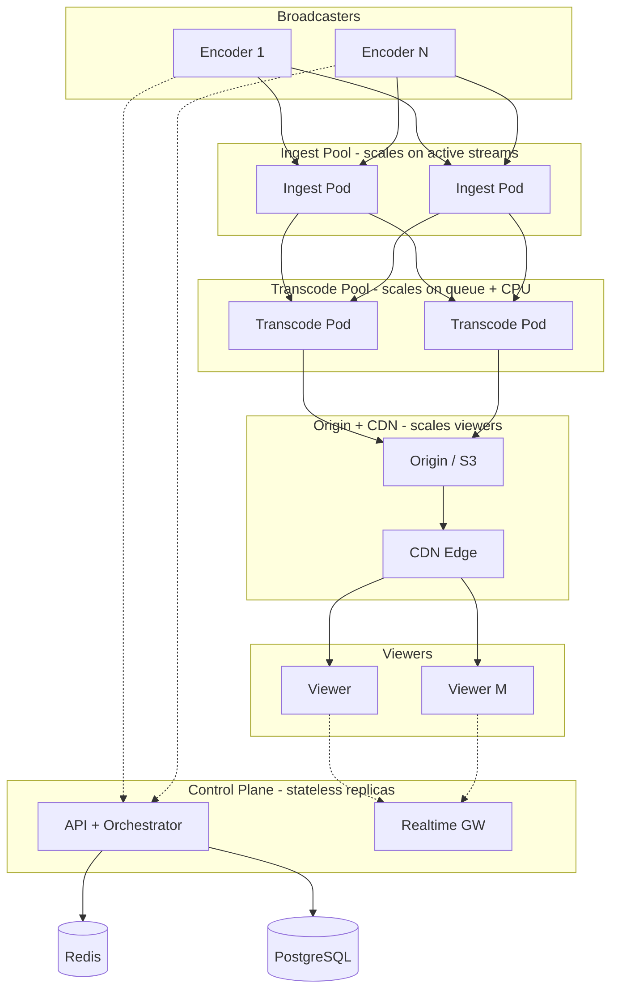
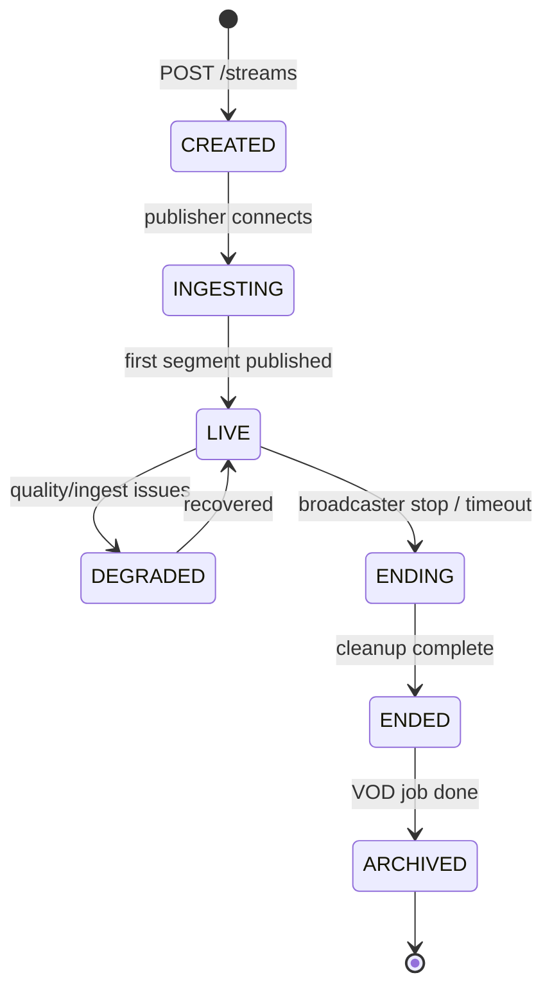

# Aruna Talent Streaming Platform — Technical Implementation Plan

**Scope:** Application layer (frontend, backend, media pipeline, containers, distributed deployment)  
**Primary design principle:** Scalable live streaming first — high concurrent streams and viewers, efficient horizontal growth across containers and infrastructure

---

## Table of Contents

1. [Executive Summary](#1-executive-summary)
2. [Platform Goals & Scale Targets](#2-platform-goals--scale-targets)
3. [System Architecture](#3-system-architecture)
4. [Service Breakdown](#4-service-breakdown)
5. [Live Streaming Pipeline](#5-live-streaming-pipeline)
6. [Frontend & Backend Responsibilities](#6-frontend--backend-responsibilities)
7. [Database & Caching Strategy](#7-database--caching-strategy)
8. [Real-Time Communication](#8-real-time-communication)
9. [Container & Service Structure](#9-container--service-structure)
10. [Scaling Strategy](#10-scaling-strategy)
11. [Load Balancing](#11-load-balancing)
12. [Queues & Background Jobs](#12-queues--background-jobs)
13. [Monitoring & Logging](#13-monitoring--logging)
14. [CI/CD Expectations](#14-cicd-expectations)
15. [Security Considerations](#15-security-considerations)
16. [Recommended Tech Stack](#16-recommended-tech-stack)
17. [Development Phases & Milestones](#17-development-phases--milestones)
18. [Appendix: Architecture Diagrams](#18-appendix-architecture-diagrams)

---

## 1. Executive Summary

Aruna Talent is building a **scalable live streaming platform** designed to support **many concurrent live broadcasts** and **large simultaneous viewer audiences**, with capacity added by **horizontal scaling of stateless application services** and **elastic media/infrastructure tiers**—not by scaling single monolithic servers vertically.

The platform spans:

| Layer | Responsibility |
|-------|----------------|
| **Ingest** | Accept broadcaster streams (RTMP, SRT, WebRTC publish) |
| **Processing** | Transcode, package (HLS/DASH), thumbnails, DVR optional |
| **Distribution** | CDN/edge delivery to viewers at global scale |
| **Control plane** | Stream lifecycle, auth, rooms, chat, monetization hooks |
| **Data plane** | Metrics, presence, concurrent viewer counts, billing events |

**Application-layer ownership** (this plan’s focus):

- Production-ready **frontend** (broadcaster studio, player, discovery) and **backend** (APIs, orchestration, webhooks)
- **Containerized**, deployment-ready services with health checks and graceful shutdown
- Architecture optimized for **fault tolerance**, **multi-AZ** operation, and **stateless** control services
- **Autoscaling** driven by active streams, ingest bitrate, viewer concurrency, and queue depth

**Design mantra:** Viewers scale on the **edge (CDN)**; encoders scale on **ingest/transcode pools**; business logic scales on **stateless API/worker replicas**.

---

## 2. Platform Goals & Scale Targets

### 2.1 Functional goals

- Creators/broadcasters can **go live** with stable ingest and sub-minute time-to-first-frame for viewers (mode-dependent)
- Viewers can **watch** via web/mobile with adaptive bitrate (ABR)
- Platform supports **rooms/channels**, permissions, and optional chat, tips, and moderation
- **Operational visibility**: per-stream health, bitrate, viewer count, regional breakdown
- **Graceful degradation**: single ingest node or transcode worker failure must not kill unrelated streams

### 2.2 Scale targets (design drivers — tune with product)

| Dimension | Phase 1 (MVP) | Phase 3 (Growth) | Phase 5 (Scale) |
|-----------|---------------|------------------|-----------------|
| Concurrent **live streams** | 50 | 500 | 5,000+ |
| Concurrent **viewers** (platform-wide) | 5,000 | 100,000 | 1M+ |
| Peak viewers **per stream** | 500 | 10,000 | 100,000+ |
| Ingest bitrate (per stream) | up to 6 Mbps | up to 8 Mbps | up to 10 Mbps |
| End-to-end latency (HLS) | 10–30 s | 10–30 s | 10–30 s |
| End-to-end latency (WebRTC/LL-HLS) | 1–5 s | 1–5 s | sub-3 s target |

*Numbers are planning anchors; capacity tests must validate before each phase gate.*

### 2.3 Quality attributes (priority order)

1. **Scalability** — add capacity by adding pods/nodes/CDN PoPs  
2. **Availability** — no single point of failure for control plane; media path degrades gracefully  
3. **Performance** — stable playback under packet loss; fast stream start  
4. **Cost efficiency** — scale-to-zero where possible; spot/preemptible for batch transcode  
5. **Security** — signed URLs, stream keys, abuse prevention  
6. **Observability** — per-stream and platform-wide SLOs  

### 2.4 Engineering SLOs (production)

| Metric | Target |
|--------|--------|
| Stream start success rate | ≥ 99.5% |
| Playback start (p95) | < 3 s (CDN cache warm) |
| API p95 (control plane) | < 200 ms |
| Ingest disconnect recovery | Automatic reconnect within 30 s |
| Control plane uptime | 99.9% monthly |
| Media pipeline alert time | < 2 min from anomaly to page |

---

## 3. System Architecture

### 3.1 Logical architecture (control + data plane)

```
                         ┌──────────────────────────────────────────┐
                         │           CDN / Edge (viewers)            │
                         │   HLS/DASH segments, LL-HLS, WebRTC SFU   │
                         └────────────────────▲─────────────────────┘
                                              │ playback
┌─────────────┐    ┌──────────────┐    ┌──────┴───────┐    ┌─────────────────┐
│ Broadcaster │───▶│ Ingest Tier  │───▶│ Media Proc.  │───▶│ Origin / Packager│
│ (OBS/Web)   │    │ RTMP/SRT/WHIP│    │ Transcode    │    │ HLS/DASH/DVR     │
└─────────────┘    └──────┬───────┘    └──────┬───────┘    └────────┬────────┘
                            │                   │                      │
                            │    events         │                      │
                            ▼                   ▼                      ▼
                     ┌────────────────────────────────────────────────────────┐
                     │              Control Plane (stateless)                  │
                     │  API Gateway → Stream Orchestrator → Identity/Rooms    │
                     │              → Chat → Analytics → Webhooks             │
                     └──────────────────────────┬─────────────────────────────┘
                                                │
              ┌─────────────────────────────────┼─────────────────────────────────┐
              │                                 │                                 │
       ┌──────▼──────┐                   ┌──────▼──────┐                   ┌──────▼──────┐
       │ PostgreSQL  │                   │    Redis    │                   │  Message    │
       │ (metadata)  │                   │ presence,   │                   │  Broker     │
       │             │                   │ live counts │                   │             │
       └─────────────┘                   └─────────────┘                   └──────┬──────┘
                                                                                    │
                                                                             ┌──────▼──────┐
                                                                             │   Workers   │
                                                                             └─────────────┘

┌─────────────┐         WebSocket / WebRTC signaling
│   Viewers   │◀──────────────────────────────────────── Control + Realtime Gateway
└─────────────┘
```

### 3.2 Control plane vs. data plane

| Plane | Components | Scaling model |
|-------|------------|---------------|
| **Control plane** | REST/GraphQL APIs, orchestrator, auth, billing hooks, chat API | Horizontal pod autoscaling (CPU/RPS) |
| **Media data plane** | Ingest, transcode, package, origin | Horizontal scaling on **active streams** and **Mbps** |
| **Distribution plane** | CDN, edge cache, optional SFU clusters | CDN auto-scales; SFU pools scale on **participants** |

**Rule:** Control-plane services remain **stateless**; stream state lives in **DB + Redis + orchestrator state machine**, never in a single API instance’s memory.

### 3.3 Delivery modes (multi-protocol strategy)

| Mode | Protocol path | Best for | Viewer scale |
|------|---------------|----------|--------------|
| **Standard live (default)** | RTMP/SRT ingest → transcode → HLS/DASH → CDN | Mass audiences, stability | Very high |
| **Low-latency live** | LL-HLS or CMAF chunked | Interactive streams, moderate delay | High |
| **Realtime room** | WebRTC (WHIP/WHEP) + SFU | Co-hosting, panel, ultra-low latency | Medium–high (per room) |

Phase 1 ships **RTMP → HLS → CDN**; Phase 2 adds **LL-HLS**; Phase 3 expands **WebRTC/SFU** for interactive features.

### 3.4 Architectural patterns

- **Stream Orchestrator** — central state machine: `created → ingesting → live → ended → archived`
- **Event-driven** — ingest start/stop, viewer join/leave, quality switches → async consumers
- **Signed URLs** — time-limited playback and ingest credentials per stream/session
- **Cell-based scaling (future)** — partition ingest pools by region or shard key (`tenant_id`) for blast-radius control
- **Modular monolith (Phase 1)** for control APIs with **strict module boundaries**; extract hot paths (orchestrator, realtime) when metrics demand

---

## 4. Service Breakdown

### 4.1 Media services (data plane)

| Service | Responsibility | Stateful? | Scale metric |
|---------|----------------|-----------|--------------|
| **Ingest Gateway** | RTMP/SRT termination, auth stream keys, forward to processors | Session-bound per stream | Active ingest connections, ingress Mbps |
| **Transcode / Transmux Pool** | ABR ladder (1080p→360p), audio normalize, keyframe align | Ephemeral per job | Active transcode jobs, CPU |
| **Packager / Origin** | HLS/DASH segment generation, playlist updates, DVR window | Segments on object storage | Segments/sec, disk I/O |
| **WebRTC SFU** (Phase 3+) | Fan-out media to room participants | Per-room state in memory | Participants, outbound Mbps |
| **Recording / VOD Worker** | Post-live MP4/HLS archive to object storage | Job-based | Queue depth |

### 4.2 Control plane services (application layer)

| Service | Responsibility | Stateful? | Scale metric |
|---------|----------------|-----------|--------------|
| **API Gateway** | TLS, rate limits, routing, WAF integration | No | RPS |
| **Stream Orchestrator** | Create/end streams, assign ingest endpoints, CDN config | No | Stream lifecycle RPS |
| **Identity & Access** | Users, creators, API keys, stream keys, RBAC | No | Auth RPS |
| **Room / Channel Service** | Rooms, titles, categories, visibility, geo rules | No | CRUD RPS |
| **Realtime Gateway** | Chat, presence, live viewer counts, signaling | No* | WS connections, msgs/sec |
| **Analytics / Metrics** | Ingest health, QoE, concurrent viewers, dashboards | No | Write/read RPS |
| **Integration / Webhooks** | External platforms, payout events, moderation tools | No | Webhook throughput |
| **Notification Worker** | Email, push, internal alerts | No | Queue depth |
| **Thumbnail / Clip Worker** | Periodic frame capture, highlight clips | No | Job queue |

\*Realtime uses Redis pub/sub for cross-replica fan-out; pods remain stateless.

### 4.3 Stream lifecycle (orchestrator)

```
POST /v1/streams → allocate stream_id, stream_key, ingest_url
       → state: CREATED
Broadcaster connects → ingest confirms publish
       → state: LIVE (emit stream.live_started)
Viewer requests playback → signed CDN URL issued
       → analytics: viewer_join events
Broadcaster disconnect / API end → state: ENDED
       → trigger VOD packaging job → state: ARCHIVED
```

All transitions are **idempotent** and persisted; workers react to events, not polling.

### 4.4 API principles

- Versioned REST (`/v1/streams`, `/v1/rooms`, `/v1/playback/...`)
- OpenAPI contracts; SDK generation for web/mobile
- `Idempotency-Key` on stream create, end, and monetization mutations
- `X-Request-Id` / `X-Stream-Id` correlation across logs and traces

---

## 5. Live Streaming Pipeline

This is the **core** of the platform—not a secondary integration.

### 5.1 End-to-end pipeline (standard HLS path)

```
[Broadcaster]
     │ RTMP/SRT (OBS, mobile SDK, browser via WHIP later)
     ▼
[Ingest Node Pool]  ──auth via stream_key──▶  [Orchestrator validates]
     │
     ▼
[Transcode Pool]  ── ABR renditions: 1080p, 720p, 480p, 360p + audio
     │
     ▼
[Packager]  ── fMP4/CMAF or TS segments → [Origin / Object Storage]
     │
     ▼
[CDN Distribution]  ── edge cache → [Player: hls.js / Shaka / native]
     │
     ▼
[Viewers]  ABR switch based on bandwidth
```

### 5.2 Ingest tier

| Concern | Design decision |
|---------|-----------------|
| Protocol | **RTMP** (Phase 1), **SRT** (Phase 2), **WHIP** (WebRTC publish, Phase 3) |
| Load balancing | DNS/geo routing or anycast to **ingest pool**; stream key hashes to consistent node optional |
| Auth | Short-lived stream key + optional IP allowlist; reject before transcode burns CPU |
| Health | Heartbeat from ingest; orchestrator marks stream `degraded` if no frames N seconds |
| Failover | Backup ingest URL; broadcaster OBS reconnect; dual-publish optional (advanced) |

**Implementation options:**

- **Managed:** Livepeer, Mux, AWS IVS, Cloudflare Stream (faster TTM, less ops)
- **Self-hosted:** nginx-rtmp, OvenMediaEngine, MediaMTX, custom FFmpeg workers (max control, higher ops burden)

**Recommendation:** Abstract behind `MediaProvider` interface; start managed or hybrid (self ingest + CDN) per cost/ops tradeoff ADR.

### 5.3 Transcoding & packaging

| Output | Purpose |
|--------|---------|
| ABR ladder | Adaptive playback across networks |
| Master playlist | `.m3u8` / DASH MPD referencing variants |
| Segment duration | 2–6 s (trade latency vs. efficiency); 4 s common for HLS |
| Keyframe interval | 2 s aligned GOP for clean ABR switches |
| Audio | AAC stereo; separate audio-only rendition for low bandwidth |

- Transcode jobs run in **worker containers** with FFmpeg or hardware encoders (NVENC) where available
- **Job queue** assigns work; autoscale workers on **queue lag** and **CPU**
- **Never** run unbounded transcodes on API pods

### 5.4 CDN & origin

| Layer | Role |
|-------|------|
| **Origin** | S3-compatible bucket or dedicated origin nginx serving segments |
| **CDN** | CloudFront, Fastly, Cloudflare, Bunny — cache segments close to viewers |
| **Signed URLs** | CloudFront signed cookies/URLs or token auth at edge |
| **Cache strategy** | Long TTL for segments; short TTL for live playlists |

**Viewer scaling:** 95%+ of viewer traffic must **not** hit origin or API—only the CDN edge.

### 5.5 Low-latency path (Phase 2+)

```
Ingest → CMAF/chunked encode → LL-HLS playlist (PART-HOLD-MSN)
       → CDN supports LL-HLS → Player with ll-hls.js or native Safari
```

Target: **3–8 s** glass-to-glass vs. 15–30 s for standard HLS.

### 5.6 WebRTC / SFU path (Phase 3+)

```
Publisher (WHIP) → SFU (selective forwarding) → Subscribers (WHEP/WebRTC)
Signaling via Realtime Gateway (SDP offer/answer, ICE)
TURN servers for restrictive NATs
```

- SFU scales by **participant count** and **simulcast layers**
- Separate deployment from HLS ingest (different resource profile)
- Hybrid: HLS for mass audience + WebRTC for on-stage guests

### 5.7 Event streaming (platform telemetry)

Parallel **event bus** for non-media metadata:

| Event | Producer | Consumers |
|-------|----------|-----------|
| `stream.live_started` | Ingest/Orchestrator | Analytics, Webhooks, Search index |
| `stream.live_ended` | Orchestrator | VOD worker, Billing |
| `viewer.joined` / `viewer.left` | Player beacon / CDN logs | Analytics, Redis counts |
| `ingest.bitrate_changed` | Ingest | Monitoring, alerts |
| `transcode.job_failed` | Worker | Retry, DLQ, on-call |

**Rules:** at-least-once delivery, idempotent consumers (`event_id`), partition by `stream_id`.

### 5.8 DVR and VOD (optional)

- **DVR window:** rolling N-hour manifest (requires origin playlist manipulation)
- **Post-live VOD:** worker stitches segments → MP4 or HLS archive in object storage
- **Clips:** short FFmpeg jobs from timestamp range

---

## 6. Frontend & Backend Responsibilities

### 6.1 Frontend surfaces

| Surface | Users | Key capabilities |
|---------|-------|------------------|
| **Broadcaster studio** | Creators | Go live, stream health, bitrate, scene/settings, end stream |
| **Player / watch page** | Viewers | ABR playback, quality selector, theater mode, embed |
| **Discovery / browse** | Viewers | Live now, categories, search |
| **Ops / admin** | Internal | Active streams map, kill switch, abuse review, capacity dashboard |
| **Embed widget** | Partners | iframe player with signed token |

### 6.2 Frontend responsibilities

- **Player:** hls.js (Chrome/Firefox) / native HLS (Safari); handle stall recovery, quality switches
- **Stream health UI:** WebSocket metrics (bitrate, FPS, dropped frames) from Realtime Gateway
- **Auth:** HttpOnly sessions; playback tokens fetched server-side (never embed long-lived secrets)
- **Broadcaster:** RTMP URL + stream key display; optional browser publish (WebRTC) later
- **Performance:** Lazy-load player; prefetch only after user intent (click “Watch”)
- **Resilience:** Exponential backoff on WS; fallback playlist URL rotation if CDN edge fails

### 6.3 Backend responsibilities

- **Orchestration:** Stream CRUD, ingest URL allocation, CDN URL signing
- **Authorization:** Who can publish, who can watch (public, unlisted, private, geo-blocked)
- **Playback tokens:** Short TTL JWT or CDN-signed URL tied to `stream_id` + `user_id`
- **Viewer counting:** Heartbeat aggregation → Redis HyperLogLog or incremental counters → periodic flush to DB
- **Abuse:** Rate limits on stream create; automated kill switch API
- **Webhooks:** `stream.started`, `stream.ended`, `viewer.milestone` to external systems

### 6.4 BFF pattern

```
Browser → Next.js → BFF routes → Internal APIs (orchestrator, auth, playback)
```

- Initial watch page load: single BFF call returns `{ playbackUrl, chatWsUrl, streamMeta }`
- Keeps signing keys off the client

### 6.5 Phased frontend delivery

Detailed **per-phase frontend deliverables, weekly milestones, and exit criteria** are in [Section 17 — Development Phases & Milestones](#17-development-phases--milestones). Frontend work runs in parallel with backend/media from Phase 0 (scaffold and design system) through Phase 5 (embed SDK, i18n, regional UX).

---

## 7. Database & Caching Strategy

### 7.1 PostgreSQL (system of record)

| Domain | Tables (logical) | Notes |
|--------|------------------|-------|
| **Streams** | `streams`, `stream_sessions`, `stream_keys` | Lifecycle states, ingest endpoints |
| **Rooms** | `rooms`, `room_members` | Title, category, visibility |
| **Users** | `users`, `roles`, `creators` | RBAC, bans |
| **Analytics** | `stream_stats_rollups` (hourly/daily) | Raw events → TSDB optional later |
| **VOD** | `recordings`, `clips` | Pointers to object storage |
| **Audit** | `audit_log` | Admin actions, kill switch |

- **RLS** where multi-tenant (`creator_id` / `org_id`)
- **Read replicas** for discovery and reporting queries
- **PgBouncer** for connection pooling from many API pods

### 7.2 Redis (hot path)

| Use case | Pattern |
|----------|---------|
| Live viewer count | `INCR` / `PFADD` per `stream_id`, TTL refreshed on live |
| Active streams set | `SET live:streams` updated by orchestrator |
| Presence | Hash `room:{id}:presence` |
| Stream metadata cache | `stream:{id}:meta` JSON, invalidate on update |
| Rate limiting | Token bucket per IP/user |
| Pub/Sub | Chat + metric fan-out to Realtime Gateway |
| Distributed locks | Single leader for aggregation cron |

**Rule:** Redis holds **ephemeral/concurrent** data; Postgres holds **authoritative** stream history.

### 7.3 Object storage

- Live segments: `/{env}/live/{stream_id}/{rendition}/segment_*.m4s`
- VOD archive: `/{env}/vod/{stream_id}/master.m3u8`
- Thumbnails: `/{env}/thumbs/{stream_id}/{ts}.jpg`
- Lifecycle policies: delete live segments after N days; retain VOD per product rules

### 7.4 Time-series (Phase 3+)

- **Prometheus** for ops metrics; **TimescaleDB** or **ClickHouse** if sub-second analytics over millions of viewer events

---

## 8. Real-Time Communication

### 8.1 Channels

| Channel | Protocol | Purpose |
|---------|----------|---------|
| **Playback** | HLS/DASH over HTTPS (CDN) | Mass viewer distribution |
| **Chat / reactions** | WebSocket | Room interaction |
| **Stream health (broadcaster)** | WebSocket | Bitrate, FPS, dropped frames |
| **Signaling (WebRTC)** | WebSocket | SDP/ICE for SFU path |
| **Live metrics (ops)** | WebSocket / SSE | Platform concurrent streams/viewers |

### 8.2 Realtime Gateway

- Separate deployment from REST API (connection-heavy)
- Auth at connect: short-lived ticket from BFF
- Topics: `stream:{id}:chat`, `stream:{id}:metrics`, `platform:ops`
- **Horizontal scale:** Redis (or NATS) pub/sub bridge—any gateway pod can deliver to any client
- **Avoid sticky sessions** unless a specific SFU co-location requirement exists

### 8.3 Viewer count accuracy

| Method | Tradeoff |
|--------|----------|
| Player heartbeat (every 30s) | Simple; slight over-count possible |
| CDN log analysis (delayed) | Accurate; not real-time |
| Hybrid | Redis live estimate + batch reconcile from CDN logs |

---

## 9. Container & Service Structure

### 9.1 Container images

| Image | Purpose | Notes |
|-------|---------|-------|
| `aruna-api` | Control plane REST | Stateless, fast scale |
| `aruna-orchestrator` | Stream state machine | Can merge with API in Phase 1 |
| `aruna-realtime` | WebSocket gateway | High connection limits |
| `aruna-worker` | Async jobs, VOD, webhooks | Queue-driven HPA |
| `aruna-ingest` | RTMP/SRT termination | **CPU/network** optimized |
| `aruna-transcode` | FFmpeg workers | GPU optional; job timeout |
| `aruna-packager` | HLS/DASH manifest | Co-locate with origin or separate |
| `aruna-web` | Next.js frontend | SSR + static |
| `aruna-migrate` | DB migration job | Run on deploy |

### 9.2 Dockerfile standards

- Multi-stage builds; non-root user
- `HEALTHCHECK` — API: `/health/ready`; Ingest: publish test hook; Transcode: worker heartbeat
- Graceful shutdown: drain ingest sessions (SIGTERM handler, 30–60s grace period)
- Resource requests/limits defined per image class (see below)

### 9.3 Kubernetes layout

```yaml
# Conceptual — production namespace: aruna-prod
deployments:
  - api          # HPA: CPU + RPS
  - realtime     # HPA: active connections (custom metric)
  - worker       # HPA: queue depth (KEDA)
  - ingest       # HPA: active_streams OR ingress_mbps (custom)
  - transcode    # HPA: queue lag + CPU
  - web
ingress:
  - /api → api
  - /ws  → realtime
  - /*   → web
  # Ingest often uses separate LB (TCP/1935) or dedicated hostname
```

### 9.4 Resource profiles (starting points)

| Service | CPU request | Memory | Notes |
|---------|-------------|--------|-------|
| API | 250m | 512Mi | Scale freely |
| Ingest | 1–2 cores | 1–2Gi | Per ~10–20 streams (validate) |
| Transcode | 2–4 cores | 2–4Gi | 1–2 streams per pod (software encode) |
| Realtime | 500m | 512Mi | Per ~5k–10k WS (validate) |

### 9.5 Local development (Docker Compose)

```yaml
services:
  postgres:
  redis:
  nats:
  api:
  orchestrator:
  realtime:
  worker:
  web:
  # Optional local media stack:
  mediamtx:      # or ovenmediaengine for RTMP → HLS dev
  minio:         # S3-compatible origin
```

---

## 10. Scaling Strategy

### 10.1 Stateless control plane checklist

| Service | Stateless? | Externalized state |
|---------|------------|-------------------|
| API / Orchestrator | Yes | Postgres, Redis |
| Realtime Gateway | Yes | Redis pub/sub |
| Workers | Yes | Queue, object storage |
| Ingest | Per-stream session* | Stream routing table in Redis/DB |
| Transcode | Job-based | Queue |
| Player traffic | Yes | CDN (no app servers) |

\*Ingest pods hold active TCP sessions but are **replaceable** with broadcaster reconnect; no durable state on disk.

### 10.2 Horizontal scaling dimensions

| Dimension | Action |
|-----------|--------|
| More concurrent **streams** | Scale ingest + transcode pools |
| More **viewers** | CDN capacity (primary); optimize origin cache hit ratio |
| More **chat/WS** | Scale realtime pods + Redis cluster |
| More **API traffic** | Scale API pods |
| **Geographic** expansion | Regional ingest endpoints + CDN PoPs |

### 10.3 Autoscaling signals (KEDA / HPA custom metrics)

| Metric | Scales |
|--------|--------|
| `active_ingest_streams` | Ingest deployment |
| `transcode_queue_depth` | Transcode workers |
| `nginx_ingress_requests_per_second` | API |
| `websocket_connections` | Realtime |
| `cdn_origin_offload_ratio` | Alert if drops (origin overload) |

### 10.4 Capacity formula (planning)

```
Ingress Mbps ≈ active_streams × avg_bitrate_per_stream
Transcode CPU ≈ active_streams × ladders × encode_complexity
Origin egress ≈ concurrent_viewers × avg_bitrate × (1 - cache_hit_ratio)
CDN egress ≈ concurrent_viewers × avg_bitrate  (primary cost driver)
```

### 10.5 Degradation modes

| Condition | Behavior |
|-----------|----------|
| Transcode pool saturated | Reject new streams with 503 + retry-after; protect existing |
| CDN partial outage | Failover to secondary CDN hostname |
| Origin overload | Increase segment TTL slightly; alert ops |
| Redis down | Playback continues (CDN); chat/counts degraded banner |
| Single ingest node loss | Broadcaster reconnect to pool via backup URL |

### 10.6 Cell-based / multi-region (Phase 5)

- **Cells:** `us-east`, `eu-west` — each with ingest + transcode + regional origin
- Global control plane routes `stream_id` → cell at creation
- Cross-cell failover is complex; design explicit DR runbooks

---

## 11. Load Balancing

### 11.1 Traffic types

| Traffic | LB type | Notes |
|---------|---------|-------|
| HTTPS (API, web, player page) | L7 ALB / Ingress | Path routing, TLS |
| RTMP/SRT ingest | L4 NLB (TCP) | Long-lived connections; optional PROXY protocol |
| WebSocket | L7 with upgrade support | Idle timeout > heartbeat interval |
| CDN | Provider-managed | Cache by URL path |

### 11.2 Ingest load balancing

- **DNS round-robin** to ingest pool (`ingest.us.platform.com`)
- Optional **consistent hash** on `stream_key` for cache locality (advanced)
- **Health checks:** TCP + application-level “can accept publish”

### 11.3 Playback load balancing

- **100% CDN-fronted** for segment traffic
- Origin shield / mid-tier cache to protect object storage

### 11.4 Rate limiting

| Endpoint | Limit |
|----------|-------|
| `POST /v1/streams` | Per user/org |
| Playback token mint | Per IP + per stream |
| Chat WS messages | Per user per second |
| Ingest auth failures | Per IP (anti-bruteforce) |

---

## 12. Queues & Background Jobs

### 12.1 Broker

**Recommendation:** NATS JetStream (K8s-friendly, streaming semantics) or cloud-native SQS/SNS on AWS.

Abstract via internal `MessageBus` interface for portability.

### 12.2 Job categories

| Priority | Jobs |
|----------|------|
| **Critical** | Stream state reconciliation, failed transcode retry, kill-switch propagation |
| **Media** | VOD stitch, clip export, thumbnail generation |
| **Analytics** | Rollup viewer minutes, export reports |
| **Integrations** | Webhooks, external platform sync |
| **Maintenance** | Segment cleanup, expired token purge |

### 12.3 Standards

- Idempotent handlers (`job_id`, `stream_id`)
- Exponential backoff + DLQ
- **Outbox pattern** for DB + event atomicity
- Cron leaders via Redis distributed lock

---

## 13. Monitoring & Logging

### 13.1 Observability stack

| Pillar | Tool |
|--------|------|
| Metrics | Prometheus + Grafana |
| Logs | Loki / CloudWatch (structured JSON) |
| Traces | OpenTelemetry → Tempo/Jaeger |
| Media-specific | Ingest bitrate, segment publish rate, buffer health |
| Errors | Sentry |
| Synthetic | Playback probe (headless player script every 1m per region) |

### 13.2 Media golden signals

| Signal | Description |
|--------|-------------|
| **Ingest FPS / bitrate** | Detect camera/encoder issues |
| **Transcode lag** | Time from ingest frame to first segment |
| **Segment publish gap** | Missing segments → playback stall |
| **CDN cache hit ratio** | Cost and origin protection |
| **Playback start time** | QoE for viewers |
| **Rebuffer rate** | Client-reported or inferred |

### 13.3 Platform golden signals

- Concurrent live streams
- Concurrent viewers (platform + per stream)
- API latency / error rate
- WS connection churn
- Queue depth / DLQ size

### 13.4 Alerting (initial)

| Alert | Condition |
|-------|-----------|
| Stream start failure spike | > 2% in 5m |
| Segment gap | No new segment > 2× target duration |
| Origin 5xx | > 1% from origin |
| Transcode queue lag | Oldest job > 5m |
| CDN offload drop | Cache hit < threshold |
| Ingest pool at capacity | Rejecting publishes |

### 13.5 Logging standards

- Correlate: `request_id`, `stream_id`, `user_id`, `ingest_node`, `cdn_pop` (if known)
- **Never log:** stream keys, playback signing secrets, raw tokens

---

## 14. CI/CD Expectations

### 14.1 Monorepo layout

```
apps/
  web/              # Next.js player + broadcaster UI
  api/              # Control plane
  orchestrator/     # Optional split
  realtime/
  worker/
packages/
  media-contracts/  # Shared event schemas
  player-sdk/       # Optional embed SDK
infra/
  helm/
  terraform/
```

### 14.2 Pipeline stages

```
Push → Lint + typecheck + unit tests
     → Contract tests (stream lifecycle)
     → Build container matrix (api, ingest, transcode, web, ...)
     → Integration tests (Testcontainers: Postgres, Redis, NATS)
     → Media smoke test (publish test pattern RTMP → HLS playlist valid)
     → Security scan (Trivy, SAST)
     → Push images (tag: git sha)
     → Deploy dev (auto) → staging (main) → prod (manual approval)
     → Post-deploy: synthetic playback probe
```

### 14.3 Deployment strategies

| Service | Strategy |
|---------|----------|
| API / web | Rolling update |
| Transcode workers | Rolling; drain jobs before terminate |
| Ingest | **Cautious rolling** — announce maintenance; grace period for reconnect |
| CDN config | Versioned Terraform; invalidate only when necessary |

### 14.4 Load testing gates

Before production scale milestones:

- Simulate N concurrent **mock publishes** (FFmpeg `-re` test sources)
- Simulate M **viewers** via Locust/k6 fetching playlists + segments (or CDN load test tool)
- Measure origin offload and transcode queue under burst

---

## 15. Security Considerations

### 15.1 Streaming-specific threats

| Threat | Mitigation |
|--------|------------|
| Stream key theft | Rotate keys; per-session keys; IP binding optional |
| Playback URL sharing | Short TTL signed URLs; optional domain restrict |
| Ingest flooding | Auth before transcode; per-IP rate limits |
| Chat abuse | Rate limits, moderation API, ban hooks |
| DDoS on player | CDN + WAF; origin not exposed publicly |
| Content piracy restream | Watermarking (Phase 4), forensic ID, geo-block |

### 15.2 Auth model

| Actor | Mechanism |
|-------|-----------|
| Broadcaster | OAuth + stream key for ingest |
| Viewer (public) | Unsigned or signed playback token |
| Viewer (private) | JWT playback claim tied to subscription |
| Service-to-service | mTLS or signed JWT |
| Admin | SSO + MFA + audit |

### 15.3 Data protection

- TLS everywhere; encrypt segments at rest if policy requires
- Secrets in Vault / AWS Secrets Manager
- Minimal PII in analytics events

---

## 16. Recommended Tech Stack

| Layer | Choice | Reasoning |
|-------|--------|-----------|
| **Frontend** | Next.js, TypeScript, Tailwind, shadcn/ui | SSR for SEO/discovery; mature player ecosystem |
| **Player** | hls.js + native Safari HLS | ABR at scale via CDN |
| **Control API** | Node (NestJS) | Team velocity vs. raw performance |
| **Orchestrator** | Node (state machine module) | Clear lifecycle ownership |
| **Ingest** | MediaMTX / OvenMediaEngine / managed IVS | ADR required; abstract provider |
| **Transcode** | FFmpeg workers (K8s jobs) or managed | GPU nodes when cost-effective |
| **Origin** | S3 + CloudFront (or equivalent) | Durable segments + global cache |
| **Database** | PostgreSQL 16 | Relational integrity for streams/users |
| **Cache** | Redis 7 Cluster | Counts, presence, pub/sub |
| **Queue** | NATS JetStream | Event fan-out + worker scaling |
| **Realtime** | WebSocket gateway + Redis adapter | Chat, metrics, signaling |
| **WebRTC SFU** | Livekit (self-host) or Pion-based custom | Phase 3; proven SFU |
| **Containers** | Docker + Kubernetes | Standard for multi-service scale |
| **IaC** | Terraform + Helm | Reproducible regional expansion |
| **Observability** | Prometheus, Grafana, OTel, Sentry | SLO-driven ops |

### 16.1 Build

| Component | Build | Managed |
|-----------|-------|---------------|
| CDN | Configure | CloudFront/Fastly/Cloudflare |
| RTMP ingest at scale | Self-host pool | IVS, Mux, Livepeer |
| WebRTC SFU | Livekit self-host | Livekit Cloud |
| Transcode | FFmpeg workers | Managed transcoding API |

**Phase 1 pragmatic path:** Managed ingest + CDN + self-built control plane, **or** self-hosted MediaMTX + S3 + CloudFront if cost control is critical.

---

## 17. Development Phases & Milestones

Phases are organized as **three parallel tracks** that must stay aligned:

| Track | Scope |
|-------|--------|
| **Backend / media** | APIs, ingest, transcode, CDN, workers, orchestration |
| **Frontend** | Next.js apps, player, broadcaster studio, discovery, ops UI, embed SDK |
| **Shared** | Auth contracts, design system, CI, observability, API types |

Frontend work **starts in Phase 0** (scaffold and design system), not after the API is “done.” Each phase lists **frontend deliverables**, **milestones**, and **exit criteria** in addition to backend/media work.

### Phase 0 — Foundation (Weeks 1–2)

#### Backend / media

| Deliverable |
|-------------|
| Monorepo, Docker Compose (Postgres, Redis, NATS, API, Web) |
| Stream/Orchestrator module skeleton + state machine |
| CI: lint, test, build images |
| ADR-001: media provider (managed vs self-hosted ingest) |
| Health/metrics bootstrap (Prometheus endpoints) |

#### Frontend

| Deliverable |
|-------------|
| `apps/web` Next.js 15 scaffold (App Router, TypeScript, Tailwind) |
| `packages/ui` — design tokens, typography, color system, shadcn/ui baseline |
| Root layout, error boundaries, loading skeletons |
| Auth shell: login/logout pages wired to API stub (or mock) |
| Route map documented: `/`, `/watch/[id]`, `/studio`, `/browse` (placeholders) |
| `packages/api-client` — OpenAPI codegen pipeline in CI |
| Frontend CI: `lint`, `typecheck`, `build`, component tests (Vitest + RTL) |
| Docker image `aruna-web` in Compose alongside API |
| Dev proxy: Next.js → local API for BFF routes |


#### Phase exit criteria

| Track | Criterion |
|-------|-----------|
| **Backend / media** | Local RTMP test publish → dev HLS playlist playable in browser |
| **Frontend** | All placeholder routes render; auth shell works against dev API; web image deploys to staging |

---

### Phase 1 — Core live path (Weeks 3–7)

#### Backend / media

| Deliverable |
|-------------|
| Stream create/end API + stream keys |
| Ingest → transcode (single ladder) → origin → CDN playback |
| Signed playback URLs |
| Basic concurrent viewer count (Redis) |
| BFF: `GET /api/streams/[id]/playback` returns signed URL + metadata |

#### Frontend

| Deliverable |
|-------------|
| **`packages/player`** — HLS player wrapper (hls.js + Safari native fallback) |
| **Watch page** (`/watch/[streamId]`) — fetch playback via BFF; loading/error/offline states |
| Player controls: play/pause, volume, fullscreen, live badge |
| Stall recovery UX: buffering indicator, automatic retry with backoff |
| **Broadcaster studio** (`/studio`) — create stream, display RTMP URL + stream key (copy-to-clipboard) |
| Go live / end stream actions; connection status (waiting / live / ended) |
| Stream health panel (polling Phase 1; WebSocket in Phase 2) |
| **Embed widget** — minimal iframe route `/embed/[streamId]` + `postMessage` API for parent pages |
| Server Actions or BFF routes for stream CRUD (no secrets in client bundle) |
| Viewer heartbeat hook (30s) for concurrent count |
| Responsive layout: mobile-first watch page; studio usable on tablet+ |
| Storybook: `Player`, `StreamStatusBadge`, `IngestCredentials` |
| Playwright E2E: create stream → open watch page → video element plays test stream |


#### Phase exit criteria

| Track | Criterion |
|-------|-----------|
| **Backend / media** | 50 concurrent test streams, 5k simulated viewers in staging; p95 playback start < 3s |
| **Frontend** | Broadcaster can complete go-live flow in UI; viewer watch page p95 start < 3s in synthetic test; player recovery from simulated segment gap; E2E suite green |

---

### Phase 2 — Scale & resilience (Weeks 8–11)

#### Backend / media

| Deliverable |
|-------------|
| Ingest + transcode autoscaling (KEDA/HPA) |
| Multi-rendition ABR ladder |
| Realtime Gateway: chat + live metrics |
| Origin shield + CDN cache tuning |
| Runbooks: ingest drain, CDN failover |

#### Frontend

| Deliverable |
|-------------|
| **Discovery / browse** (`/browse`, `/`) — “Live now” grid with SSR for SEO |
| Stream cards: thumbnail, title, viewer count, category; infinite scroll or pagination |
| Category and search filters (debounced client + server query) |
| **Quality selector** in player — manual rendition override when ABR ladder available |
| **Realtime integration** — WebSocket client module (`packages/realtime`): reconnect, topic subscribe |
| Live viewer count on watch page (WS-driven, fallback to poll) |
| **Chat panel** on watch page — message list, send, connection status |
| Broadcaster studio: **live metrics over WS** (bitrate, FPS, dropped frames) replacing poll |
| Degraded-state UI: “Stream experiencing issues” when API reports `DEGRADED` |
| CDN failover: player retries alternate playback hostname from BFF |
| **Performance** — lazy-load player chunk; LCP < 2.5s on browse (lab); route-level code splitting |
| **Accessibility pass** — keyboard player controls, chat focus trap, aria-live for new messages |
| Storybook + visual regression (Chromatic or Percy) for browse cards and chat |
| Playwright: browse → watch → send chat message |


#### Phase exit criteria

| Track | Criterion |
|-------|-----------|
| **Backend / media** | 500 concurrent streams in staging; origin offload > 90%; ingest pod kill → broadcaster reconnect |
| **Frontend** | Browse handles 100+ live cards without layout jank; chat stable under WS reconnect test; WCAG AA on watch + browse; Web Vitals within budget |

---

### Phase 3 — Low latency & analytics (Weeks 12–15)

#### Backend / media

| Deliverable |
|-------------|
| LL-HLS or CMAF low-latency path |
| Analytics rollups + ops APIs |
| VOD archive post-stream |
| Webhook integrations |
| DVR window (optional) |

#### Frontend

| Deliverable |
|-------------|
| **LL-HLS player mode** in `packages/player` — ll-hls.js or native; feature flag per stream |
| Latency indicator on watch page (“~5s behind live”) |
| **VOD / replay page** (`/watch/[streamId]/replay`) — post-live playback from archive manifest |
| **DVR seek bar** (if enabled) — sliding window on live edge |
| **Ops / admin dashboard** (`apps/admin` or protected `/ops`) — active streams table, health, kill switch |
| Platform overview: concurrent streams, concurrent viewers, ingest alerts |
| Per-stream drill-down: bitrate chart, viewer count timeline (chart library: Recharts or similar) |
| **Analytics hooks** — client QoE beacons: playback start, rebuffer events, quality switches |
| Broadcaster post-stream summary page — duration, peak viewers, avg bitrate |
| Share / clip UI stub (timestamp selection) if clips API available |
| Admin role-gated routes; unauthorized → 403 page |
| Playwright: ops user ends stream via kill switch; VOD page plays archive |

#### Phase exit criteria

| Track | Criterion |
|-------|-----------|
| **Backend / media** | LL-HLS glass-to-glass < 8s in test; analytics lag < 30s for viewer counts |
| **Frontend** | LL-HLS mode plays in Chrome + Safari smoke tests; ops dashboard used in staging game-day; QoE events visible in analytics UI |

---

### Phase 4 — WebRTC & interactive (Weeks 16–19)

#### Backend / media

| Deliverable |
|-------------|
| WHIP/WHEP or SFU integration (Livekit) |
| Co-host / panel rooms |
| TURN deployment |
| Moderation APIs (slow mode, ban, delete message) |

#### Frontend

| Deliverable |
|-------------|
| **`packages/player-webrtc`** — WebRTC subscribe/publish; signaling via Realtime Gateway |
| **Browser broadcaster path** (optional) — WHIP publish from studio without OBS |
| **Co-host / guest UI** — invite link, join room, tile layout (2–8 tiles), dominant speaker highlight |
| Device selector: camera, mic, speaker; pre-live preview |
| **Hybrid watch experience** — HLS mass audience + WebRTC stage for guests (clear UX separation) |
| **Moderation UI** — mod tools on watch page: delete message, timeout user, slow mode toggle |
| Broadcaster moderation queue — flagged messages list |
| Connection quality indicator (packet loss, RTT) for WebRTC participants |
| TURN failure UX — actionable error (“check firewall / try relay”) |
| Mobile WebRTC: graceful fallback message where unsupported |
| Storybook: `ParticipantTile`, `DeviceSelector` |
| Playwright (where feasible): multi-context guest join; moderation ban flow |


#### Phase exit criteria

| Track | Criterion |
|-------|-----------|
| **Backend / media** | 100-participant WebRTC room stable; hybrid HLS + WebRTC guests |
| **Frontend** | Co-host E2E in staging; moderation actions reflect in chat within 1s; WebRTC reconnect restores A/V < 5s |

---

### Phase 5 — Global scale & cells (Weeks 20+)

#### Backend / media

| Deliverable |
|-------------|
| Multi-region ingest cells |
| ClickHouse/Timescale for viewer event analytics |
| Cell-based blast-radius isolation |
| Advanced DRM/watermark evaluation |
| Cost optimization (spot transcode, tiered storage) |

#### Frontend

| Deliverable |
|-------------|
| **Regional routing awareness** — BFF returns nearest ingest + playback endpoints; studio shows region |
| **Embed SDK** (`packages/embed-sdk`) — documented JS API for partners: mount player, events, destroy |
| **PWA / mobile web** enhancements — add-to-home, background audio policy documented |
| **i18n** — locale files, RTL-ready layout audit, language switcher |
| **Advanced discovery** — personalized rails, following feed (if social graph exists) |
| **Performance at scale** — virtualized browse grid; skeleton streaming for card thumbnails |
| **Edge-cached static** — aggressive CDN cache headers for `_next/static` |
| Load testing: 10k concurrent mock viewers on browse (k6 browser or static shell + API mock) |
| Feature flags (Unleash/LaunchDarkly) for gradual regional rollouts |
| DRM evaluation UI (if adopted) — encrypted stream playback in supported browsers only |
| Documentation site: broadcaster setup guide, embed integration, OBS profiles |

#### Phase exit criteria

| Track | Criterion |
|-------|-----------|
| **Backend / media** | Multi-region failover drill; path to 5k+ concurrent streams documented and tested |
| **Frontend** | Embed SDK integrated by one partner pilot; browse performant with 1k+ live cards (virtualized); i18n complete for en + one secondary locale |

---

## 18. Appendix: Architecture Diagrams

### 18.1 Concurrent streams & viewers scaling



### 18.2 Stream state machine



